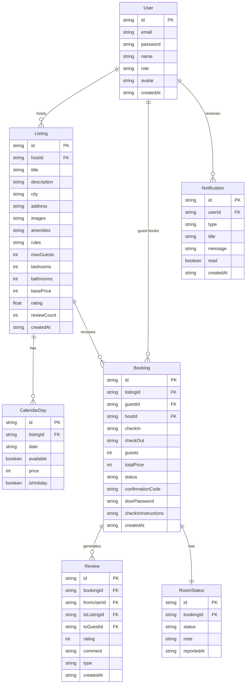

## 1. 架构设计

```mermaid
flowchart TB
    subgraph "前端层"
        "React SPA (Vite + Tailwind + Zustand)"
    end
    subgraph "后端层"
        "Express.js API Server"
    end
    subgraph "数据层"
        "SQLite Database"
    end
    subgraph "服务层"
        "邮件服务 (Nodemailer)"
        "定时任务 (node-cron)"
    end
    "React SPA (Vite + Tailwind + Zustand)" --> "Express.js API Server"
    "Express.js API Server" --> "SQLite Database"
    "Express.js API Server" --> "邮件服务 (Nodemailer)"
    "Express.js API Server" --> "定时任务 (node-cron)"
```

## 2. 技术说明

- 前端: React@18 + Tailwind CSS@3 + Vite + Zustand + React Router DOM
- 初始化工具: vite-init
- 后端: Express@4 + TypeScript (ESM)
- 数据库: SQLite (better-sqlite3)，开发阶段使用模拟数据
- 邮件: Nodemailer（模拟发送，控制台输出）
- 定时任务: node-cron（入住前一天提醒）
- 认证: JWT Token 简易认证

## 3. 路由定义

| 路由 | 用途 |
|------|------|
| / | 首页，搜索与推荐 |
| /search | 搜索结果页，筛选与房源列表 |
| /listing/:id | 房源详情页，图片/设施/评价/预订 |
| /booking/:id | 预订流程页，日期确认/支付/完成 |
| /booking/confirm/:bookingId | 预订确认页 |
| /host/dashboard | 房东管理后台首页 |
| /host/listings | 房东房源管理 |
| /host/listings/new | 新增房源 |
| /host/listings/:id/edit | 编辑房源 |
| /host/listings/:id/calendar | 日历定价管理 |
| /host/bookings | 房东订单管理 |
| /host/reviews | 房东评价管理 |
| /guest/dashboard | 租客个人中心 |
| /guest/bookings | 租客我的预订 |
| /guest/reviews | 租客评价管理 |
| /login | 登录页 |
| /register | 注册页 |

## 4. API 定义

### 4.1 认证相关

```typescript
POST /api/auth/register
  Body: { email: string; password: string; name: string; role: "host" | "guest" }
  Response: { token: string; user: User }

POST /api/auth/login
  Body: { email: string; password: string }
  Response: { token: string; user: User }
```

### 4.2 房源相关

```typescript
GET /api/listings?city=&checkIn=&checkOut=&guests=&minPrice=&maxPrice=&page=&limit=
  Response: { listings: Listing[]; total: number; page: number }

GET /api/listings/:id
  Response: Listing & { reviews: Review[]; calendarDays: CalendarDay[] }

POST /api/listings
  Body: { title: string; description: string; city: string; address: string; images: string[]; amenities: string[]; rules: string[]; maxGuests: number; bedrooms: number; bathrooms: number; basePrice: number }
  Response: Listing

PUT /api/listings/:id
  Body: Partial<Listing>
  Response: Listing

GET /api/listings/:id/calendar?month=&year=
  Response: CalendarDay[]

PUT /api/listings/:id/calendar
  Body: { days: { date: string; available: boolean; price: number; isHoliday: boolean }[] }
  Response: CalendarDay[]
```

### 4.3 预订相关

```typescript
POST /api/bookings
  Body: { listingId: string; checkIn: string; checkOut: string; guests: number }
  Response: Booking & { locked: boolean }

POST /api/bookings/:id/pay
  Body: { paymentMethod: string }
  Response: Booking & { confirmationCode: string; doorPassword: string }

GET /api/bookings/guest
  Response: Booking[]

GET /api/bookings/host
  Response: Booking[]

PUT /api/bookings/:id/status
  Body: { status: "confirmed" | "rejected" | "checkedin" | "checkedout" | "cancelled" }
  Response: Booking
```

### 4.4 评价相关

```typescript
POST /api/reviews
  Body: { bookingId: string; rating: number; comment: string; type: "guest_to_listing" | "host_to_guest" }
  Response: Review

GET /api/reviews/listing/:listingId
  Response: Review[]

GET /api/reviews/host
  Response: Review[]
```

### 4.5 通知与房间状态

```typescript
GET /api/notifications
  Response: Notification[]

PUT /api/room-status/:bookingId
  Body: { status: string; note: string }
  Response: RoomStatus
```

### 4.6 数据类型定义

```typescript
interface User {
  id: string;
  email: string;
  name: string;
  role: "host" | "guest";
  avatar: string;
  createdAt: string;
}

interface Listing {
  id: string;
  hostId: string;
  title: string;
  description: string;
  city: string;
  address: string;
  images: string[];
  amenities: string[];
  rules: string[];
  maxGuests: number;
  bedrooms: number;
  bathrooms: number;
  basePrice: number;
  rating: number;
  reviewCount: number;
  createdAt: string;
}

interface CalendarDay {
  id: string;
  listingId: string;
  date: string;
  available: boolean;
  price: number;
  isHoliday: boolean;
}

interface Booking {
  id: string;
  listingId: string;
  guestId: string;
  hostId: string;
  checkIn: string;
  checkOut: string;
  guests: number;
  totalPrice: number;
  status: "pending" | "confirmed" | "rejected" | "checkedin" | "checkedout" | "cancelled";
  confirmationCode: string;
  doorPassword: string;
  checkInInstructions: string;
  createdAt: string;
}

interface Review {
  id: string;
  bookingId: string;
  fromUserId: string;
  toListingId?: string;
  toGuestId?: string;
  rating: number;
  comment: string;
  type: "guest_to_listing" | "host_to_guest";
  createdAt: string;
}

interface Notification {
  id: string;
  userId: string;
  type: "new_booking" | "booking_confirmed" | "booking_rejected" | "checkin_reminder" | "review_request";
  title: string;
  message: string;
  read: boolean;
  createdAt: string;
}

interface RoomStatus {
  id: string;
  bookingId: string;
  status: string;
  note: string;
  reportedAt: string;
}
```

## 5. 服务端架构图

```mermaid
flowchart TD
    "Router / Controller" --> "Service Layer"
    "Service Layer" --> "Repository / DAO"
    "Repository / DAO" --> "SQLite Database"
    "Service Layer" --> "Notification Service"
    "Service Layer" --> "Email Service (Nodemailer)"
    "Cron Scheduler" --> "Notification Service"
```

## 6. 数据模型

### 6.1 数据模型定义



### 6.2 数据定义语言

```sql
CREATE TABLE users (
  id TEXT PRIMARY KEY,
  email TEXT UNIQUE NOT NULL,
  password TEXT NOT NULL,
  name TEXT NOT NULL,
  role TEXT NOT NULL CHECK(role IN ('host', 'guest')),
  avatar TEXT DEFAULT '',
  created_at TEXT DEFAULT (datetime('now'))
);

CREATE TABLE listings (
  id TEXT PRIMARY KEY,
  host_id TEXT NOT NULL REFERENCES users(id),
  title TEXT NOT NULL,
  description TEXT DEFAULT '',
  city TEXT NOT NULL,
  address TEXT DEFAULT '',
  images TEXT DEFAULT '[]',
  amenities TEXT DEFAULT '[]',
  rules TEXT DEFAULT '[]',
  max_guests INTEGER DEFAULT 1,
  bedrooms INTEGER DEFAULT 1,
  bathrooms INTEGER DEFAULT 1,
  base_price INTEGER NOT NULL,
  rating REAL DEFAULT 0,
  review_count INTEGER DEFAULT 0,
  created_at TEXT DEFAULT (datetime('now'))
);

CREATE TABLE calendar_days (
  id TEXT PRIMARY KEY,
  listing_id TEXT NOT NULL REFERENCES listings(id),
  date TEXT NOT NULL,
  available INTEGER DEFAULT 1,
  price INTEGER NOT NULL,
  is_holiday INTEGER DEFAULT 0,
  UNIQUE(listing_id, date)
);

CREATE TABLE bookings (
  id TEXT PRIMARY KEY,
  listing_id TEXT NOT NULL REFERENCES listings(id),
  guest_id TEXT NOT NULL REFERENCES users(id),
  host_id TEXT NOT NULL REFERENCES users(id),
  check_in TEXT NOT NULL,
  check_out TEXT NOT NULL,
  guests INTEGER DEFAULT 1,
  total_price INTEGER NOT NULL,
  status TEXT DEFAULT 'pending' CHECK(status IN ('pending','confirmed','rejected','checkedin','checkedout','cancelled')),
  confirmation_code TEXT DEFAULT '',
  door_password TEXT DEFAULT '',
  check_in_instructions TEXT DEFAULT '',
  created_at TEXT DEFAULT (datetime('now'))
);

CREATE TABLE reviews (
  id TEXT PRIMARY KEY,
  booking_id TEXT NOT NULL REFERENCES bookings(id),
  from_user_id TEXT NOT NULL REFERENCES users(id),
  to_listing_id TEXT REFERENCES listings(id),
  to_guest_id TEXT REFERENCES users(id),
  rating INTEGER NOT NULL CHECK(rating >= 1 AND rating <= 5),
  comment TEXT DEFAULT '',
  type TEXT NOT NULL CHECK(type IN ('guest_to_listing', 'host_to_guest')),
  created_at TEXT DEFAULT (datetime('now'))
);

CREATE TABLE notifications (
  id TEXT PRIMARY KEY,
  user_id TEXT NOT NULL REFERENCES users(id),
  type TEXT NOT NULL,
  title TEXT NOT NULL,
  message TEXT NOT NULL,
  read INTEGER DEFAULT 0,
  created_at TEXT DEFAULT (datetime('now'))
);

CREATE TABLE room_status (
  id TEXT PRIMARY KEY,
  booking_id TEXT NOT NULL REFERENCES bookings(id),
  status TEXT NOT NULL,
  note TEXT DEFAULT '',
  reported_at TEXT DEFAULT (datetime('now'))
);

CREATE INDEX idx_listings_city ON listings(city);
CREATE INDEX idx_listings_host ON listings(host_id);
CREATE INDEX idx_calendar_listing_date ON calendar_days(listing_id, date);
CREATE INDEX idx_bookings_listing ON bookings(listing_id);
CREATE INDEX idx_bookings_guest ON bookings(guest_id);
CREATE INDEX idx_bookings_host ON bookings(host_id);
CREATE INDEX idx_bookings_status ON bookings(status);
CREATE INDEX idx_reviews_listing ON reviews(to_listing_id);
CREATE INDEX idx_notifications_user ON notifications(user_id);
```
